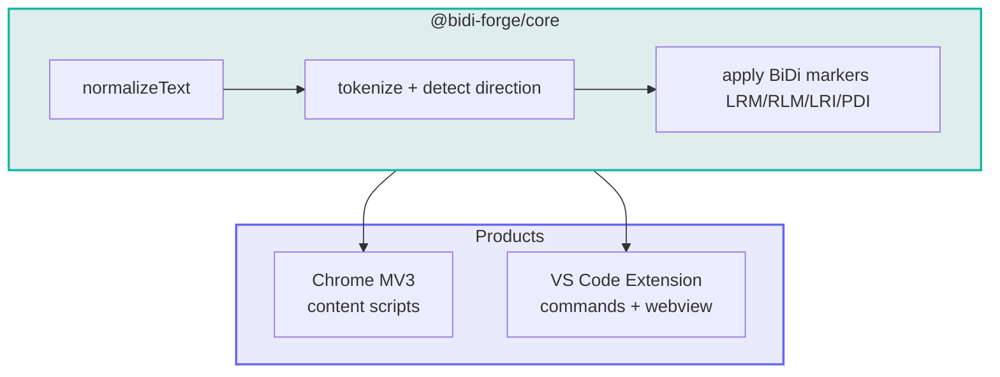

<div align="center">

<!-- Animated gradient banner -->


<!-- Pulsing logo ring (inline SVG) -->
<svg width="120" height="120" viewBox="0 0 120 120" xmlns="http://www.w3.org/2000/svg" aria-hidden="true">
  <defs>
    <linearGradient id="bf-ring" x1="0%" y1="0%" x2="100%" y2="100%">
      <stop offset="0%" stop-color="#14b8a6">
        <animate attributeName="stop-color" values="#14b8a6;#6366f1;#14b8a6" dur="4s" repeatCount="indefinite"/>
      </stop>
      <stop offset="100%" stop-color="#6366f1">
        <animate attributeName="stop-color" values="#6366f1;#14b8a6;#6366f1" dur="4s" repeatCount="indefinite"/>
      </stop>
    </linearGradient>
    <filter id="bf-glow" x="-50%" y="-50%" width="200%" height="200%">
      <feGaussianBlur stdDeviation="3" result="blur"/>
      <feMerge><feMergeNode in="blur"/><feMergeNode in="SourceGraphic"/></feMerge>
    </filter>
  </defs>
  <rect x="18" y="18" width="84" height="84" rx="22" fill="#0f172a" stroke="url(#bf-ring)" stroke-width="3" filter="url(#bf-glow)">
    <animateTransform attributeName="transform" type="rotate" from="0 60 60" to="360 60 60" dur="12s" repeatCount="indefinite"/>
  </rect>
  <text x="60" y="72" text-anchor="middle" font-family="ui-monospace, SFMono-Regular, Menlo, monospace" font-size="32" font-weight="700" fill="url(#bf-ring)">BF</text>
</svg>

<br />

<!-- Typing animation -->
<a href="https://git.io/typing-svg">
  
</a>

<br /><br />

[](https://opensource.org/licenses/MIT)
[](https://www.typescriptlang.org/)
[](https://developer.chrome.com/docs/extensions/mv3/)
[](https://code.visualstudio.com/)

<br />

[](https://github.com/BIDI-Forge)
[](https://github.com/BIDI-Forge/bidi-forge)
[](https://github.com/BIDI-Forge/bidi-forge/stargazers)

</div>

---

## ✦ The problem we solve

When **RTL** scripts (Persian, Arabic) meet **LTR** text (English, URLs, code) in the same line, renderers often scramble word order — especially in **AI chat composers** and streaming replies.

**BIDI · Forge** inserts invisible Unicode BiDi markers so mixed text reads naturally:

```diff
- ‎Input‎:  ‏سلام‏ ‎hello‎ ‏دنیا‏
+ ‎Output‎: ‏سلام‏ ‎hello‎ ‏دنیا‏
```

> Local-only · No telemetry · Works in the browser & editor · Built for real bilingual workflows

---

## ✦ Products

<table>
<tr>
<td width="50%" valign="top">

### 🌐 Chrome Extension
**BIDI - Forge** · MV3

- Claude-first AI chat presets
- ChatGPT · Gemini · Grok · Qwen
- CSS-only composers where needed
- Lightweight scope · sync settings

<br />

[](https://github.com/BIDI-Forge/bidi-forge/tree/main/packages/chrome-extension)

</td>
<td width="50%" valign="top">

### 💻 VS Code / Cursor
**RTL Text Fixer**

- Fix selection or clipboard
- BiDi-safe notifications & settings UI
- Status bar · scoped RTL workbench CSS
- Powered by shared core engine

<br />

[](https://github.com/BIDI-Forge/bidi-forge/tree/main/packages/vscode-extension)

</td>
</tr>
</table>

---

## ✦ Supported AI surfaces

<div align="center">

| Platform | Status | Approach |
|:---:|:---:|:---|
| **Claude.ai** | 🟢 Primary | ProseMirror composer + `standard-markdown` replies |
| **ChatGPT** | 🟢 Active | Composer + assistant bubbles |
| **Gemini** | 🟢 Active | CSS-only Quill composer |
| **Grok** | 🟢 Active | CSS-only ProseMirror on grok.com & X |
| **Qwen** | 🟢 Active | chat.qwen.ai presets |
| **Copilot** | 🟡 Coming soon | — |
| **Perplexity** | 🟡 Coming soon | — |
| **DeepSeek** | 🟡 Coming soon | — |

</div>

---

## ✦ Architecture



```
packages/
├── core/              Pure TS BiDi engine
├── shared/            Shared types
├── chrome-extension/  BIDI - Forge (MV3)
└── vscode-extension/  RTL Text Fixer
```

---

## ✦ Quick start

```bash
git clone https://github.com/BIDI-Forge/bidi-forge.git
cd bidi-forge
pnpm install
pnpm build
pnpm test
```

| Target | Command |
|:---|:---|
| Chrome (unpacked) | `pnpm -C packages/chrome-extension build` → load `dist/` |
| Chrome (store zip) | `pnpm -C packages/chrome-extension pack:store` |
| VS Code `.vsix` | `pnpm -C packages/vscode-extension package` |

---

## ✦ Tech stack

<div align="center">


</div>

---

## ✦ Powered by

<div align="center">

[](https://github.com/amirmkazemi)
[](https://github.com/azimhatami)

<br />

**Maintained by [BIDI-Forge](https://github.com/BIDI-Forge) · [@GSMGPT](https://github.com/GSMGPT)**

</div>

---

<div align="center">

<!-- Animated wave footer -->


<br />

**If BIDI · Forge helps your workflow, ⭐ star [bidi-forge](https://github.com/BIDI-Forge/bidi-forge) — it fuels the next AI surface.**

<br />

<sub>MIT © BIDI-Forge · Built with care for Persian, Arabic & English speakers worldwide</sub>

</div>
